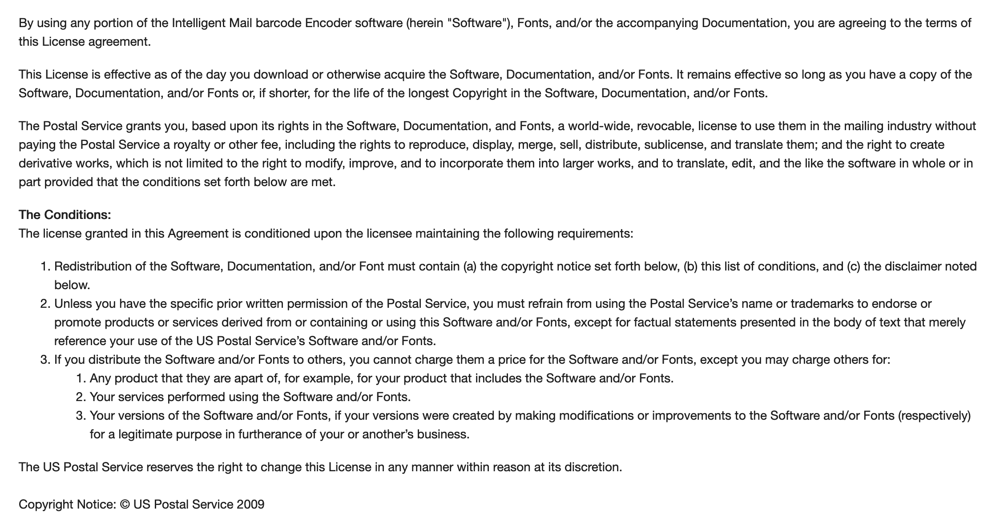

# USPS Intelligent Mail (USPS 4-State Customer Code)

This module provides a function named `func IMb(track, route string) (string, int)` for generating USPS Intelligent Mail barcode (IMb), also known as 4-State Customer Barcode. The Intelligent Mail barcode is used by the United States Postal Service (USPS) for sorting and tracking letters and flats, offering enhanced visibility into the mailstream.

### Parameters

- `track`: Tracking information for the mailpiece.
- `route`: Routing information for the mailpiece.

### Returns

- The generated Intelligent Mail barcode string. (len: 64)
- Status code. (0 for success)

## Structure of Intelligent Mail Barcode (IMb)

The Intelligent Mail barcode consists of the following components:

1. **Barcode ID**: A 2-digit field reserved to encode the presort identification.
    - Should be "00" if an Optional Endorsement Line (OEL) is not printed on the mailpiece.

2. **Service Type ID (STID)**: A 3-digit field used to identify the class of mail and additional services.
    - Defines the mailpiece as Full-Service, Basic, or Non-Automation.
    - Determines the disposition of Undeliverable-As-Addressed (UAA) mail.

3. **Mailer ID (MID)**: A unique identifier assigned by USPS to Mail Owners or Preparer, Mailing Agents, or service providers based on annual mail volume criteria.
    - 9-digit or 6-digit numeric code.

4. **Serial Number**: A 6 or 9-digit field defined by the mailer.

5. **Routing Code**: A 5, 9, or 11-digit field identifying the delivery ZIP Code data in the address.

| Data Type     | Data Field              | # of Digits               |
|:--------------|:------------------------|:--------------------------|
| Tracking Code | Barcode Identifier      | 2 (2nd digit must be 0-4) |
|               | Service Type Identifier | 3                         |
|               | Mailer Identifier       | 6 or 9                    |
|               | Serial Number           | 6 (with 6-digit MID)      |
|               |                         | 9 (with 9-digit MID)      |
| Routing Code  | Delivery Point ZIP Code | 0, 5, 9, or 11            |
| Total         |                         | 31 maximum                |

## Additional Resources

- [USPS PostalPro - Intelligent Mail Barcode](https://postalpro.usps.com/mailing/intelligent-mail-barcode)
- [USPS PostalPro - Mailer ID](https://postalpro.usps.com/mailing/mailer-id)
- [USPS PostalPro - Service Type Identifier (STID)](https://postalpro.usps.com/mailing/service-type-identifiers)
- [USPS PostalPro - Service Type Identifier (STID) Table](https://postalpro.usps.com/service-type-identifiers/stidtable)
- [USPS PostalPro - Service Type Identifier (STID) Details](https://postalpro.usps.com/node/461)
- [USPS PostalPro - Intelligent Mail Barcode FAQ](https://postalpro.usps.com/node/217)
- [USPS PostalPro - Encoder/Decoder](https://postalpro.usps.com/ppro-tools/encoder-decoder)
- [USPS PostalPro - Fonts and Encoders Download](https://postalpro.usps.com/onecodesolution)

## License

- MIT License
- USPS License Agreement

